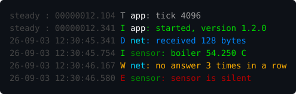

# FmtLog

Форматирование строк по образцу `{}` и лёгкий журнал для микроконтроллеров.

```cpp
log::info(F("пин {} = {}, температура {} °C"), pin, level, 54.25);
```


Вместо `%d`, `%lu` и `%.3f` — одно место вставки `{}` для любого типа.
Текст сообщения виден целиком и не разорван знаками вставки.

---

## Зачем

**Тип нельзя перепутать.** `printf` верит образцу на слово: `%d` для `long`
или забытый аргумент — это порча стека, о которой узнаёшь по перезагрузке.
Здесь тип выводится компилятором, а лишние значения молча отбрасываются.

**Свои типы печатаются как встроенные.** Одна специализация — и `IPAddress`,
адрес датчика или ваша структура подставляются в образец наравне с `int`.

**Ни байта динамической памяти.** Ни `malloc`, ни `String`, ни `std::string` —
буфер задаётся снаружи и не растёт. На микроконтроллере, работающем месяцами,
это означает отсутствие фрагментации кучи.

**Сообщение не выйдет за буфер.** Длинное обрезается по границе, и это видно
через `truncated()`. Переполнения нет ни при каких значениях.

**Журнал не привязан к выводу.** Библиотека никуда не пишет сама — куда
попадёт сообщение, решает приложение. Одно и то же сообщение уходит сразу в
несколько мест: в порт при отладке, по сети на рабочем устройстве, на карту
памяти для разбора после сбоя. Приёмники подключаются и снимаются на ходу, а
готовое сообщение приходит в них уже собранным, вместе с уровнем, источником
и временем.

**Поток читается с одного взгляда.** Уровень и источник раскрашены, поэтому
ошибка не теряется среди отладочных строк. Раскраска отключается на ходу или
убирается из прошивки совсем.

---

## Установка

**Arduino IDE** — 
1) На текущий момент, наиболее быстрый способ установки через .ZIP архив:
 - Откройте [страницу библиотеки на GitHub](https://github.com/240974a/FmtLog).
 - Нажмите зелёную кнопку <> Code в правой верхней части списка файлов и выберите Download ZIP. Архив скачается на ваш компьютер.
 - Откройте Arduino IDE.
 - В верхнем меню выберите: Скетч (Sketch) → Включать библиотеку (Include Library) → Добавить .ZIP библиотеку… (Add .ZIP Library…).
 - В открывшемся окне выберите скачанный .zip файл и нажмите Открыть (Open).
2) После выхода полноценного релиза можно будет загрузить библиотеку из Arduino Library Manager.

**PlatformIO** — в `platformio.ini`:
```ini
lib_deps = https://github.com/240974a/FmtLog.git
```

---

## Как пользоваться

### Форматирование в свой буфер

```cpp
#include <FmtLog.h>
using namespace fmtlog;

char line[64];
Fmt out(line, sizeof(line));
out.format(F("напряжение {} В, ток {} А"), 3.28, 0.42);
Serial.println(line);
```

Образец лучше держать во флеше — через `F(...)`: в RAM он тогда не попадает.

### Журнал

```cpp
void setup() {
    Serial.begin(115200);
    log::addSink(log::serialSink);
    log::setLevel(Level::info);

    log::info(F("запуск"));
    log::error(F("датчик не отвечает {} раз подряд"), 3);
}
```

### Уровни и источники

Уровень задаётся общий и отдельно по источникам — разговорчивую часть можно
приглушить, не трогая остальные:

```cpp
enum Source : uint8_t { app, net, sensor };
const char* const kNames[] = {"app", "net", "sensor"};

log::setSourceNames(kNames, 3);
log::setLevel(Level::info);       // всем
log::setLevel(net, Level::debug); // сети - подробнее

log::debugFrom(net, F("отправлено {} байт"), 128);
```

Проверка уровня идёт **до** сборки сообщения, поэтому отброшенный вызов почти
ничего не стоит — его можно оставлять и в горячем цикле.

Порог `FMTLOG_COMPILE_LEVEL` убирает вызовы совсем: при сборке с
`-D FMTLOG_COMPILE_LEVEL=2` от `trace` и `debug` в прошивке не остаётся ни
кода, ни образцов.

### Куда выводить

Приёмник — обычная функция. Библиотека вызывает её с готовым сообщением, а что
с ним делать, решаете вы:

```cpp
void toNetwork(const Record& record) {
    if(record.level < Level::warning)
        return;                       // по сети шлём только важное
    udp.beginPacket(host, port);
    udp.write(reinterpret_cast<const uint8_t*>(record.text), record.length);
    udp.endPacket();
}

log::addSink(log::serialSink);   // в порт - всё
log::addSink(toNetwork);         // по сети - только предупреждения и ошибки
```

В `Record` приходит всё, что нужно для решения: уровень, источник, время с
запуска, текст и признак того, что сообщение не поместилось целиком.

Отсюда же берутся вещи, которые журналом обычно не считают: счётчик ошибок для
показа на экране, мигание светодиодом при сбое, запись последних строк в
кольцевой буфер, чтобы отдать их по запросу. `removeSink` снимает приёмник, а
`clearSinks` — все сразу.

### Цвет

Раскраска — отдельный модуль: приложению, которому она не нужна, не достанется
даже мёртвого кода.

```cpp
#include <FmtLog.h>
#include <FmtColor.h>

const char* const kNames[]  = {"app", "net", "sensor"};
const uint8_t     kColors[] = {color::white, color::cyan, color::green};

log::setSourceNames(kNames, 3);
color::setSourceColors(kColors, 3);

log::addSink(color::serialSink);   // вместо log::serialSink
```

Так это выглядит в терминале:



<sub>Снимок собран из настоящего вывода библиотеки — `tools/make-screenshots.sh`</sub>

Время всегда тусклое — оно нужно для отсчёта, а не для чтения. Уровень
задаёт цвет строки, источник печатается своим:

| уровень | цвет | | источник | цвет |
|---|---|---|---|---|
| `T` trace | серый | | `app` | белый |
| `D` debug | синий | | `net` | голубой |
| `I` info | зелёный | | `sensor` | зелёный |
| `W` warning | жёлтый | | | |
| `E` error | красный | | | |

Обрезанное сообщение помечается красным многоточием — иначе потеря хвоста
осталась бы незаметной.

Цвета уровней тоже заменяются — массив на пять значений, от `trace` до
`error`:

```cpp
static const uint8_t kQuiet[] = {color::darkGray, color::darkGray,
                                 color::gray, color::yellow, color::red};
color::setLevelColors(kQuiet);
```

Монитор порта в Arduino IDE управляющих последовательностей не понимает и
показывает их как мусор — там нужен обычный `log::serialSink` либо снятая
раскраска:

```cpp
color::setEnabled(false);   // на ходу, приёмник менять не нужно
```

Модуль стоит **456 байт** флеша и только когда подключён.

### Свой тип

```cpp
struct Temperature { float celsius; bool valid; };

template<>
struct fmtlog::formatter<Temperature> {
    static void format(Fmt& out, const Temperature& value) {
        if(!value.valid) { out.format(F("--")); return; }
        out.format(F("{} °C"), value.celsius);
    }
};

log::info(F("бойлер {}"), Temperature{54.25f, true});
```

### Необязательное значение

Условие пишется один раз, а не по разу на префикс и на значение:

```cpp
log::info(F("команда '{}'{}"), name, opt(hasValue, F(" = "), value));
```

При ложном условии место вставки остаётся пустым.

### Готовые правила вывода

| тип | пример вывода |
|---|---|
| целые, дробные, `bool`, `char` | `-42`, `54.250`, `true`, `x` |
| `const char*`, `String`, `F("…")` | как есть |
| `Duration(1250)` | `1s:250ms` |
| `DateTime(epoch)` | `29.02.2024 12:34:56` |
| `TimeOfDay(epoch)` | `12:34:56` |
| `IPAddress` *(ESP)* | `192.168.1.10` |
| `HexDump(ptr, len)` | `0A,FF,00,12` |
| `FullDump(ptr, len)` | `"Ok." 0x4F 6B 01` |
| `EepromString(addr, max)` | строка из EEPROM |

`EepromString` подключается отдельно: `#include <FmtEeprom.h>`.

Удвоенные скобки печатают одну: `{{` → `{`.

---

## Сколько это стоит

Все числа получены сборкой, а не оценкой. Замер: сообщения вида
`"msg a={} b={}"` с двумя целыми, сравнение с `snprintf` на том же наборе.

### Флеш растёт с числом вызовов

Постоянная надбавка платится один раз, дальше растёт цена каждого вызова:

| | постоянная надбавка | каждый вызов |
|---|---|---|
| **AVR** (Uno) | 676 Б против 1574 Б у `snprintf` | 108 Б против 97 Б |
| **ESP8266** | 512 Б против 336 Б | 77 Б против 59 Б |

**На AVR** FmtLog экономит флеш примерно **до 86 вызовов** — за счёт того, что
не тянет разбор образца времени выполнения. Дальше он немного дороже.

**На ESP8266** экономии по флешу нет: `printf` там уже слинкован ядром, за него
платят независимо от вашего кода, и FmtLog добавляется поверх. Разница —
около **0.1 % флеша** на полсотни вызовов.

> Дробные выводятся собственным кодом, без `dtostrf`. На AVR это экономит
> 1380 байт флеша по сравнению с ним.

### Оперативная память

| | FmtLog | snprintf |
|---|---|---|
| динамическая память | **не используется** | не используется |
| статически | буфер сообщения (128 Б; 64 Б на AVR) + 16 Б состояния | буфер приложения |
| стек на вызов | десятки байт | зависит от реализации |

Размер буфера задаётся при сборке: `-D FMTLOG_MESSAGE_SIZE=64`.

### Скорость

Сравнение на одном и том же наборе, 200 000 повторов:

| | против `snprintf` |
|---|---|
| целые | **в 2.2 раза быстрее** |
| дробные | **в 6.2 раза быстрее** |

И те, и другие FmtLog печатает сам, целочисленной арифметикой, без разбора
образца во время выполнения.

---

## Настройка сборки

Все значения переопределяются через `-D` в `platformio.ini`:

| макрос | по умолчанию | что задаёт |
|---|---|---|
| `FMTLOG_MESSAGE_SIZE` | 128 (AVR: 64) | размер буфера сообщения |
| `FMTLOG_FLOAT_DECIMALS` | 3 | знаков после запятой |
| `FMTLOG_SOURCE_COUNT` | 8 | число источников журнала |
| `FMTLOG_COMPILE_LEVEL` | 0 | порог отсечения при сборке |

---

## Платформы

| платформа | состояние |
|---|---|
| ESP8266 | проверено сборкой |
| ESP32 | поддерживается |
| AVR (Uno, Nano, Mega) | проверено сборкой |

На AVR нет `IPAddress` — соответствующее правило вывода там не собирается.

---

## Примеры

| пример | о чём |
|---|---|
| `Basic` | образец, свой буфер, необязательное значение |
| `Logging` | уровни, источники, свой приёмник вывода |
| `Color` | цветной вывод, свои цвета уровней и источников |
| `CustomType` | подключение своего типа |
| `Levels` | смена уровня на ходу и отсечение при сборке |

---

## Тесты

Плата не нужна — разбор образца, правила вывода и работа журнала от неё не
зависят:

```
pio test -e native
```

51 тест: разбор образца, границы буфера, все правила вывода, уровни,
источники, приёмники и раскраска.

---

## История изменений

Что менялось от выпуска к выпуску — в [заметках к выпускам](RELEASE_NOTES.md).

## Лицензия

MIT
